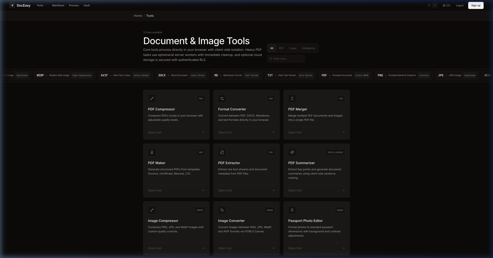
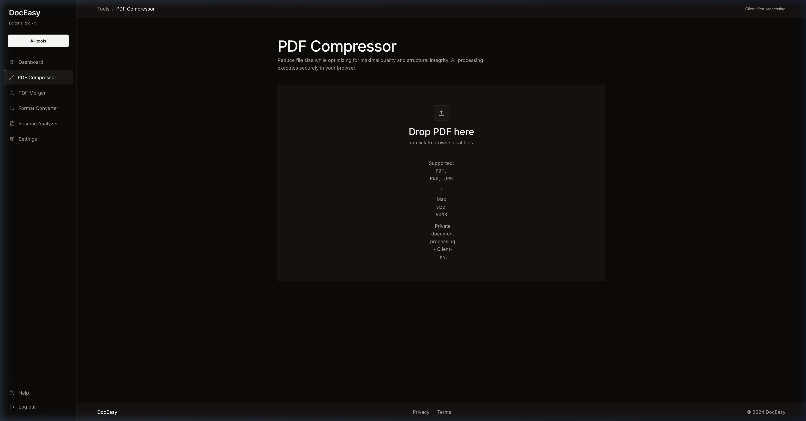
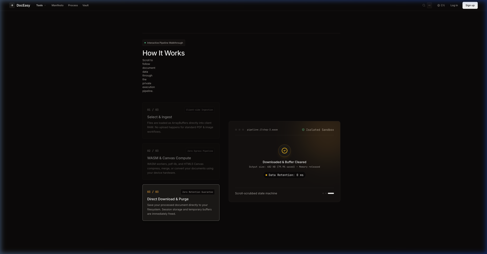
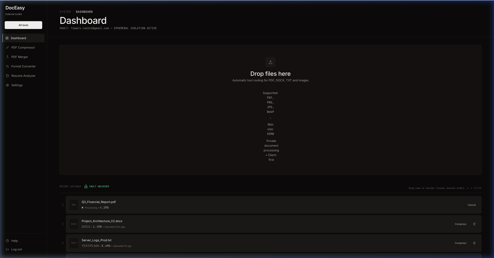

<div align="center">
  
  <h1>DocEasy Studio</h1>
  <h3>The privacy-first document and image toolkit.</h3>
  <p>Local-first WebAssembly PDF processing, instant image tools, and authenticated cloud vault — right in your browser.<br/><b>No tracking. No mandatory signups. Client-first processing.</b> Core utilities run 100% locally on your machine.</p>

  <p>
    <a href="#quickstart">Quickstart</a> ·
    <a href="#features">Features</a> ·
    <a href="#why-doceasy">vs Others</a> ·
    <a href="#tools-matrix">Tools Matrix</a> ·
    <a href="#architecture">Architecture</a> ·
    <a href="#security">Security</a> ·
    <a href="#tech-stack">Tech Stack</a> ·
    <a href="#contributing">Contributing</a> ·
    <a href="#license">License</a>
  </p>

  <p>
    <a href="https://github.com/rachts/DocEasy/stargazers"></a>
    <a href="https://github.com/rachts/DocEasy/releases"></a>
    <a href="https://nextjs.org/"></a>
    <a href="https://webassembly.org/"></a>
    <a href="https://www.typescriptlang.org/"></a>
    <a href="https://tailwindcss.com/"></a>
    <a href="LICENSE"></a>
    <a href="https://github.com/rachts/DocEasy/issues"></a>
  </p>

  <p>
    <a href="https://github.com/rachts/DocEasy"></a>
  </p>
</div>

<br/>

<div align="center">
  
</div>

> **Your documents are your most sensitive personal and business assets. Why rent them back to cloud converters?** Every mainstream online utility uploads your tax filings, contracts, resumes, and medical scans to remote servers, charging monthly fees while harvesting metadata. DocEasy flips the paradigm: compress, merge, convert, crop, and inspect documents directly on your device — 12 verified tools, instant execution, and zero outbound network traffic for local workflows.

> [!TIP]
> **Client-First Hybrid Architecture.** Core operations (PDF compression, merger, converter, photo editor, cropper, resume scoring) run 100% locally in your browser's WebAssembly sandbox. Heavy compression can optionally route to ephemeral server-side Ghostscript/qpdf workers with immediate memory purge. Cloud persistence is strictly opt-in and safeguarded by Supabase Postgres Row-Level Security (RLS).

<a id="screenshots"></a>

## 📸 See it in action

<table>
  <tr>
    <td align="center" width="50%">
      
      <br/><b>Bento Grid Toolkit</b><br/>
      <sub>3D perspective tilt cards with continuous format marquee — 12 specialized editorial and document tools.</sub>
    </td>
    <td align="center" width="50%">
      
      <br/><b>WebAssembly PDF Compressor</b><br/>
      <sub>Stream quantization in browser memory — reduce file sizes by up to 80% with zero server upload.</sub>
    </td>
  </tr>
  <tr>
    <td align="center">
      
      <br/><b>Zero-Egress Processing Pipeline</b><br/>
      <sub>Interactive 3-step scroll-scrubbed workflow: local file intake, WASM execution, and instant filesystem export.</sub>
    </td>
    <td align="center">
      
      <br/><b>Authenticated Cloud Vault</b><br/>
      <sub>Supabase Postgres RLS storage with 40ms staggered card cascades, drag-and-drop reordering, and vault padlock animation.</sub>
    </td>
  </tr>
</table>

---

<a id="features"></a>

## ✨ Features

Three flagships, five headliners, and an entire suite under the hood.

<table>
<tr>
  <td width="33%"></td>
  <td width="33%"></td>
  <td width="33%"></td>
</tr>
<tr>
  <td align="center">⚡ <b>WebAssembly Engine</b><br/><sub>In-browser PDF compression · merge · convert · zero network lag</sub></td>
  <td align="center">🎨 <b>HTML5 Canvas Studio</b><br/><sub>Aspect cropping · passport normalizer · AVIF/WebP transcode</sub></td>
  <td align="center">🔒 <b>Encrypted Cloud Vault</b><br/><sub>SubtleCrypto AES-GCM · Supabase RLS · ephemeral server purge</sub></td>
</tr>
</table>

<table>
<tr>
  <td align="center" width="20%">🚀<br/><b>100% Local Core</b><br/><sub>No keys, no cloud, no account</sub></td>
  <td align="center" width="20%">🧰<br/><b>12 Verified Tools</b><br/><sub>Production-ready utility suite</sub></td>
  <td align="center" width="20%">⚡<br/><b>Ephemeral Server</b><br/><sub>Ghostscript &amp; qpdf acceleration</sub></td>
  <td align="center" width="20%">⌨️<br/><b>Command Menu</b><br/><sub><kbd>⌘K</kbd> instant tool navigation</sub></td>
  <td align="center" width="20%">💫<br/><b>Signature Motion</b><br/><sub>WebGL hero, Lenis &amp; GSAP quickTo</sub></td>
</tr>
</table>

<details>
<summary><b>…and 10 more architectural &amp; design capabilities</b> — drop physics, ATS scoring, marquee, and friends</summary>

<br/>

- 🌀 **"The Drop" Global Overlay** — dragging files triggers an inward particle vortex, cursor magnetic pull, and odometer file size preview.
- 🎯 **ATS Resume Scorer** — local regex pattern analyzer parses resumes for action verbs, quantification, and impact metrics.
- 📄 **Client-Side PDF Summarizer** — frequency-weighted sentence ranking summarizes lengthy documents locally without external AI APIs.
- 🏷️ **CSS-Only Format Marquee** — GPU-accelerated infinite format ticker that pauses on hover and respects `prefers-reduced-motion`.
- 🔀 **View Transitions API** — seamless shared-element morph transitions linking tool cards to upload drop zones.
- 🧲 **Magnetic CTAs** — GSAP `quickTo` cursor attraction on primary action buttons (desktop-only).
- 📜 **Single-Instance Lenis** — buttery root-level smooth scrolling with GSAP ticker synchronization.
- 🌐 **WebGL Shader Plane** — custom GLSL morphing plane (`PDF → IMAGE → SHEET`) with interactive cursor ripples.
- 📱 **Mobile & Accessibility First** — automatic capability gating: desktop 3D effects are omitted on touch, preserving Lighthouse Mobile Performance >= 90.
- 🎨 **Dark Industrial Aesthetic** — curated palette (`#0C0A09`, `#141110`, `#292524`, `#FAFAF9`) with crisp typography and glassmorphism.

</details>

---

<a id="why-doceasy"></a>

## ⚖️ vs Others

Traditional PDF and image converters charge **$5–$25/month** while routing your private documents through remote servers. DocEasy operates **in your browser with zero subscription fees.**

| Feature | **Traditional Cloud Toolkits**<br/>*(Smallpdf, iLovePDF, Adobe)* | **DocEasy Studio** |
|---|---|---|
| **Pricing** | $5–$25/mo, metered usage limits | **100% Free & Open-Source (MIT)** |
| **File Processing** | Always uploaded to remote cloud | **100% local browser execution for core tools** |
| **Data Retention** | Indefinite cloud storage risks | **Zero persistent retention**; ephemeral server purge |
| **Account Required** | Mandatory signup for basic downloads | **No email or account needed for core tools** |
| **Processing Speed** | Throttled by upload/download bandwidth | **Near-instant WebAssembly & Canvas speeds** |
| **File Security** | Relies on third-party security promises | **Local volatile memory + Web Crypto AES-GCM** |
| **Heavy Compression** | Included behind paywall | **Ghostscript & qpdf server acceleration** |
| **Cloud Storage** | Proprietary locked cloud | **Authenticated Vault backed by Postgres RLS** |
| **Command Bar** | ❌ None | ✅ Global <kbd>⌘K</kbd> Command Palette |
| **Telemetry & Ads** | Invasive analytics and ad trackers | **Zero telemetry pixels, zero trackers** |
| **Inspectability** | Proprietary black box | **100% Open Source — inspect network tab** |

---

<a id="tools-matrix"></a>

## 🛠️ Tools Matrix (12 Production-Ready Tools)

DocEasy ships with 12 complete, verified tools:

| # | Tool Name | Route | Supported Formats | Engine & Architecture |
|:---:|:---|:---|:---|:---|
| 1 | **PDF Compressor** | `/tools/compress` | PDF, PNG, JPG | Client WebAssembly + Ephemeral Server Ghostscript |
| 2 | **Format Converter** | `/tools/convert` | PDF, DOCX, MD, TXT, Images | Client Parser + Canvas Transcoder |
| 3 | **PDF Merger** | `/tools/merge` | PDF, PNG, JPG, WebP | Client `pdf-lib` stream merger |
| 4 | **PDF Maker** | `/tools/pdf-maker` | Invoice, Certificate, Resume, CV | Client Template Engine + Native PDFKit |
| 5 | **PDF Extractor** | `/tools/pdf-extractor` | PDF → TXT, Metadata | Browser Stream Parser & Object Inspector |
| 6 | **PDF Summarizer** | `/tools/pdf-summarizer` | PDF, TXT → Ranked Summary | Client Frequency-Ranked Sentence Scorer |
| 7 | **Image Compressor** | `/tools/image-compressor` | PNG, JPG, WebP | Canvas Lossy/Lossless Quantization |
| 8 | **Image Converter** | `/tools/image-converter` | PNG, JPG, WebP, AVIF | HTML5 Canvas `toBlob` Pipeline |
| 9 | **Passport Photo Editor**| `/tools/passport-photo` | PNG, JPG → Passport Sizes | Canvas Preset Normalizer (US, UK, Schengen, etc.) |
| 10 | **Image Cropper** | `/tools/cropper` | PNG, JPG, WebP | Interactive Canvas Aspect Ratio Lock |
| 11 | **Resume Analyzer** | `/tools/analysis` | PDF, DOCX, TXT | Client ATS Pattern Scorer & Keyword Matcher |
| 12 | **Encrypted Vault** | `/tools/vault` | Any Document / Image | Web Crypto AES-GCM + Supabase Postgres RLS |

---

<a id="architecture"></a>

## 🏗️ Architecture

A **Next.js 16 (App Router)** frontend utilizing **WebAssembly**, **HTML5 Canvas**, and **Web Crypto**, backed by ephemeral server processing and **Supabase Postgres RLS** for authenticated storage.

```
┌─────────────────────────────────────────────────────────────────────────────┐
│                          CLIENT BROWSER SANDBOX                             │
│                                                                             │
│  [ User Document / Image ]                                                  │
│         │                                                                   │
│         ▼                                                                   │
│  [ Global File Drop / Upload ] ─── ArrayBuffer (Volatile Device Memory)     │
│                                           │                                 │
│         ┌─────────────────────────────────┼─────────────────────────────┐   │
│         │                                 │                             │   │
│         ▼                                 ▼                             ▼   │
│  ┌────────────────────┐       ┌────────────────────────┐  ┌──────────────┐  │
│  │ WebAssembly Engine │       │ HTML5 Canvas 2D Engine │  │ Web Crypto   │  │
│  │ (pdf-lib, pdfjs)   │       │ (Image Transcoding)    │  │ (AES-GCM)    │  │
│  ├────────────────────┤       ├────────────────────────┤  ├──────────────┤  │
│  │ • PDF Compress     │       │ • Format Converter     │  │ • Local Key  │  │
│  │ • PDF Merger       │       │ • Image Compressor     │  │ • Session    │  │
│  │ • Text Extractor   │       │ • Passport Photo       │  │   Isolation  │  │
│  │ • PDF Maker        │       │ • Aspect Ratio Cropper │  │ • 2-Hour TTL │  │
│  └─────────┬──────────┘       └───────────┬────────────┘  └──────┬───────┘  │
│            │                              │                      │          │
│            └──────────────────────────────┼──────────────────────┘          │
│                                           ▼                                 │
│                               [ Local Blob / ObjectURL ]                    │
│                                           │                                 │
│                                           ▼                                 │
│                               [ Direct Instant Download ]                   │
└───────────────────────────────────────────┬─────────────────────────────────┘
                                            │
                     ┌──────────────────────┴──────────────────────┐
                     │ (OPTIONAL: Server Acceleration / Sync)      │
                     ▼                                             ▼
       ┌───────────────────────────┐                 ┌───────────────────────────┐
       │ Ephemeral Server Routes   │                 │ Authenticated Cloud Vault │
       │ (Ghostscript / qpdf)      │                 │ (Supabase Postgres RLS)   │
       ├───────────────────────────┤                 ├───────────────────────────┤
       │ Heavy task execution only │                 │ Encrypted user persistence│
       │ Zero long-term retention  │                 │ Identity-gated storage    │
       │ Immediate buffer wipe     │                 │ Full session management   │
       └───────────────────────────┘                 └───────────────────────────┘
```

- **Client Execution Layer** — Runs in-memory inside modern browser sandboxes via WebAssembly and Canvas APIs. No file leaves your machine for core tasks.
- **Ephemeral Processing Pipeline** — Server-side API routes (`/api/compression`, `/api/convert/pdf`) provide heavyweight processing (Ghostscript/qpdf) with immediate post-process file unlinking.
- **Authenticated Cloud Vault** — Protected storage powered by Supabase Auth and Postgres Row Level Security (RLS), giving authenticated users persistent access across devices.

---

<a id="security"></a>

## 🔒 Security & Privacy Guarantees

DocEasy is engineered around verifiable privacy principles:

1. **Client-First Execution** — Operations happen in client memory by default. Open DevTools Network tab: verify 0 bytes outbound during local merges, conversions, and client compression.
2. **Ephemeral Backend Buffering** — When server acceleration is selected for heavy compression, files are processed in isolated temporary storage and immediately purged upon response delivery.
3. **Cryptographic Session Vault** — Local vault files utilize the Web Crypto API (`SubtleCrypto`) with 256-bit AES-GCM encryption keys held in volatile session memory.
4. **Postgres Row Level Security (RLS)** — Persistent cloud vault data is gated by strict Supabase RLS policies; users can only read, write, or delete their own authenticated files.
5. **Zero Telemetry** — No tracking pixels, no session replay scripts, no Google Analytics, and no marketing beacons.

---

<a id="quickstart"></a>

## ⚡ Quickstart

### Prerequisites
- **Node.js**: 18.18+ / 20.x / 22.x+
- **Package Manager**: `npm`, `pnpm`, or `yarn`

### 1. Clone & Install

```bash
# Clone the repository
git clone https://github.com/rachts/DocEasy.git
cd DocEasy

# Install dependencies
npm install
```

### 2. Configure Environment (Optional)

To enable the authenticated cloud vault, copy the example environment file and add your Supabase credentials:

```bash
cp .env.example .env.local
```

```env
NEXT_PUBLIC_SUPABASE_URL=https://your-project.supabase.co
NEXT_PUBLIC_SUPABASE_ANON_KEY=your-anon-key
```

*(DocEasy runs completely without Supabase — all core tools operate locally out of the box).*

### 3. Run Locally

```bash
# Start Next.js development server
npm run dev

# Open in browser
open http://localhost:3000
```

### 4. Production Build

```bash
# Compile optimized build (Turbopack)
npm run build

# Start production server
npm run start
```

### 🐳 Docker Deployment

```bash
# Build and run with Docker Compose
docker-compose up --build
```

---

<a id="tech-stack"></a>

## 🧰 Tech Stack

- **Framework**: [Next.js 16](https://nextjs.org/) (App Router, Turbopack, React 19)
- **Languages**: [TypeScript 5](https://www.typescriptlang.org/), GLSL (WebGL Shaders)
- **Styling**: [Tailwind CSS v4](https://tailwindcss.com/), [shadcn/ui](https://ui.shadcn.com/)
- **Document Engines**: `pdf-lib`, `pdfjs-dist`, HTML5 Canvas 2D
- **Server Heavy Processing**: Ghostscript, `qpdf`
- **Animation & Motion**: [GSAP 3](https://gsap.com/) (`quickTo`), [Motion](https://motion.dev/) (Framer Motion v12), [Lenis](https://lenis.darkroom.engineering/) (Smooth Scroll)
- **Backend & Auth**: [Supabase](https://supabase.com/) (Auth, Storage, Postgres RLS)
- **Cryptography**: Web Crypto API (`SubtleCrypto` AES-GCM 256-bit)
- **Icons**: [Lucide React](https://lucide.dev/)

---

<a id="contributing"></a>

## 🤝 Contributing

Contributions are welcomed! Whether it's adding new client-side document tools, refining shader animations, or improving mobile accessibility:

1. Fork the Project
2. Create your Feature Branch (`git checkout -b feature/NewTool`)
3. Commit your Changes (`git commit -m 'feat(tool): add batch watermarking tool'`)
4. Push to the Branch (`git push origin feature/NewTool`)
5. Open a Pull Request

---

<a id="license"></a>

## 📜 License

DocEasy is open-source software licensed under the [**MIT License**](LICENSE).

You are free to use, modify, distribute, and integrate this software into your personal, commercial, or enterprise workflows without royalty fees.

---

<div align="center">

<br/>

If you value privacy-first software, give DocEasy a star ⭐ on GitHub.<br/>
**[⭐ Star this repo](https://github.com/rachts/DocEasy)** to support open-source document sovereignty.

<br/>

</div>
