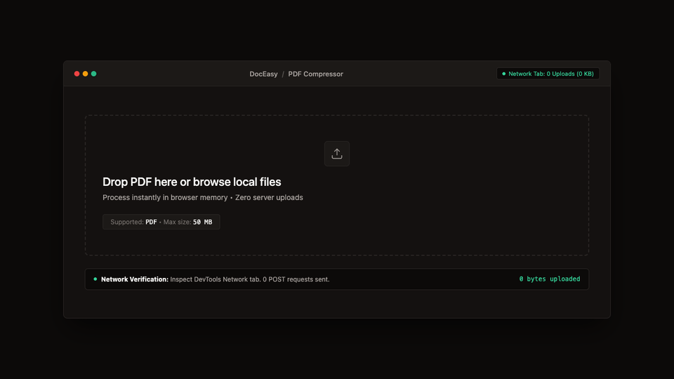

# DocEasy — Privacy-First Hybrid Document & Image Toolkit

[](https://nextjs.org/)
[](https://webassembly.org/)
[](https://www.typescriptlang.org/)
[](https://tailwindcss.com/)
[](https://developer.mozilla.org/en-US/docs/Web/API/Web_Crypto_API)
[](https://doceasy.app/privacy)
[](LICENSE)

DocEasy is a high-performance document and image processing toolkit deployed on Vercel. Engineered with a **transparent hybrid architecture**: core tools process locally in your browser via WebAssembly and HTML5 Canvas, heavy compression tasks utilize ephemeral server-side Ghostscript/qpdf pipelines with immediate cleanup, and multi-device persistence is powered by an authenticated cloud vault backed by Supabase Postgres RLS.

> **Client-first privacy. Ephemeral server processing. Authenticated cloud vault.**  
> Core utilities run 100% locally in your browser memory without creating an account.

---

## 🎬 Live Demo & Preview



*Drop PDF → Compress locally in WebAssembly thread (up to ~80% reduction) → Download compressed output.*

---

## 🏛 Why Hybrid Client-First?

Document processors have traditionally sent all user files to remote cloud servers for conversion, compression, and analysis. DocEasy minimizes exposure by running core workflows locally and isolating heavy server tasks:

| Traditional Cloud Toolkits | DocEasy Hybrid Architecture |
| :--- | :--- |
| **Always-On Server Uploads:** All files sent over the internet to remote servers. | **Client-First Execution:** Standard operations execute locally inside browser memory. |
| **Indefinite Data Retention Risk:** Files stored in long-term cloud buckets without control. | **Ephemeral Buffers & RLS:** Server jobs wipe immediately upon completion; vault uses Postgres RLS. |
| **Mandatory Signups:** Users forced to provide email for basic document tasks. | **No Account for Core Tools:** Use the complete local tool suite without signing up. |
| **Network Bottleneck:** Upload and download speeds throttle processing. | **Instant Local Processing:** Native WebAssembly execution executes with near-instant speed. |
| **Opaque Cloud Operations:** Black box servers with hidden telemetry. | **Inspectable & Open Source:** Transparent client-first code and verifiable network activity. |

---

## 📐 Architecture Diagram

```
+-------------------------------------------------------------------------------+
|                            BROWSER CLIENT SANDBOX                             |
|                                                                               |
|  [ User Document ]                                                            |
|         │                                                                     |
|         ▼                                                                     |
|  [ File API / Drag & Drop ] ─── ArrayBuffer (Local Volatile Memory)          |
|                                         │                                     |
|         ┌───────────────────────────────┴───────────────────────────────┐     |
|         │                                                               │     |
|         ▼                                                               ▼     |
|  ┌───────────────┐   ┌────────────────────────┐   ┌────────────────────────┐  |
|  │ WebAssembly   │   │ HTML5 Canvas 2D        │   │ Web Crypto API         │  |
|  │ PDF Engine    │   │ Image Engine           │   │ (AES-GCM-256)          │  |
|  ├───────────────┤   ├────────────────────────┤   ├────────────────────────┤  |
|  │ • Compress    │   │ • Image Converter      │   │ • Encrypted Vault      │  |
|  │ • Merge       │   │ • Passport Photo       │   │ • Session Storage      │  |
|  │ • Extract     │   │ • Image Compressor     │   │ • Auto-Purge TTL (2h)  │  |
|  │ • Convert     │   │ • Aspect Cropper       │   │ • Ephemeral Keys       │  |
|  └───────┬───────┘   └───────────┬────────────┘   └───────────┬────────────┘  |
|          │                       │                            │               |
|          └───────────────────────┼────────────────────────────┘               |
|                                  ▼                                            |
|                       [ Local Blob / ObjectURL ]                              |
|                                  │                                            |
|                                  ▼                                            |
|                       [ Instant Client Download ]                             |
|                                                                               |
+-------------------------------------------------------------------------------+
                                  │
                                  X  (NO OUTBOUND NETWORK CALLS)
                                  │
                          [ Remote Servers ]
```

---

## 🛠 Feature Matrix (12 Verified Working Tools)

DocEasy features exactly 12 production-ready, fully client-side tools:

| # | Tool Name | Route | Status | Supported Formats | Engine |
| :---: | :--- | :--- | :---: | :--- | :--- |
| 1 | **PDF Compressor** | `/tools/compress` | Operational | PDF, PNG, JPG | Client WebAssembly + Stream Quantization |
| 2 | **Format Converter** | `/tools/convert` | Operational | PDF, DOCX, Markdown, Text, Images | Client Parser + Canvas Renderer |
| 3 | **PDF Merger** | `/tools/merge` | Operational | PDF, PNG, JPG, WebP | PDF-Lib + Canvas Image Rasterization |
| 4 | **PDF Maker** | `/tools/pdf-maker` | Operational | Invoice, Certificate, Resume, CV → PDF | Template Engine + Native PDFKit |
| 5 | **PDF Extractor** | `/tools/pdf-extractor` | Operational | PDF → TXT, Metadata | Browser Stream Parser |
| 6 | **PDF Summarizer** | `/tools/pdf-summarizer` | Operational | PDF, TXT → Ranked Summary | Client Sentence Frequency TF Scorer |
| 7 | **Image Compressor** | `/tools/image-compressor` | Operational | PNG, JPG, WebP | Canvas Lossy/Lossless Quantization |
| 8 | **Image Converter** | `/tools/image-converter` | Operational | PNG, JPG, WebP, AVIF | HTML5 Canvas `toBlob` Pipeline |
| 9 | **Passport Photo Editor** | `/tools/passport-photo` | Operational | PNG, JPG → Standard Passport Sizes | Canvas Preset Normalizer (US, UK, Schengen, etc.) |
| 10 | **Image Cropper** | `/tools/cropper` | Operational | PNG, JPG, WebP | Interactive Canvas Aspect Ratio Lock |
| 11 | **Resume Analyzer** | `/tools/analysis` | Operational | PDF, DOCX, TXT | Client ATS Pattern Scorer & Keyword Matcher |
| 12 | **Encrypted Vault** | `/tools/vault` | Operational | Any Document / Image | Web Crypto AES-GCM (2-hour TTL Auto-Purge) |

---

## 🔒 Security & Privacy Guarantees
 
- **No Telemetry Harvesting**: Zero analytics pixels, zero session recorders, zero document profiling.
- **Client Session Encryption**: The optional client session vault generates a 256-bit AES-GCM cryptographic key stored solely in the browser's `sessionStorage` with a 2-hour auto-purge.
- **Ephemeral Server Pipelines**: When heavy Ghostscript/qpdf compression is run, temporary server files are wiped immediately upon stream completion.
- **Authenticated Cloud Vault**: Authenticated users store persistent vault files in Supabase Storage isolated with Postgres Row Level Security (RLS).

---

## 🚀 Local Development

### Prerequisites
- Node.js 18.x, 20.x, or 22.x+
- npm, pnpm, or yarn

### Quick Start

```bash
# 1. Clone the repository
git clone https://github.com/rachts/DocEasy.git
cd DocEasy

# 2. Install dependencies
npm install

# 3. Start development server
npm run dev

# 4. Open browser
open http://localhost:3000
```

### Production Build

```bash
# Create optimized production build
npm run build

# Run production server locally
npm run start
```

---

## 🧰 Tech Stack

- **Framework**: Next.js 16 (Turbopack, App Router, React 19)
- **Runtime**: WebAssembly + Modern Browser Web APIs
- **Typography & Design**: Warm Industrial Palette (`#0C0A09`, `#141110`, `#1C1917`, `#292524`, `#FAFAF9`)
- **Icons**: Lucide React
- **Cryptography**: Web Crypto API (SubtleCrypto AES-GCM 256-bit)
- **Deployment**: Vercel Edge Network

---

## 📄 License

DocEasy is open source software licensed under the [MIT License](LICENSE).
